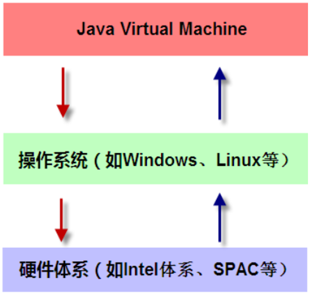
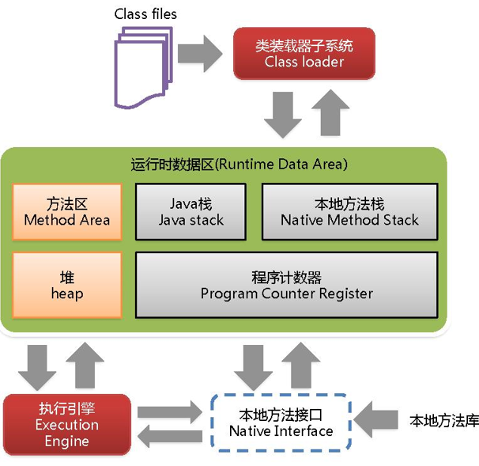
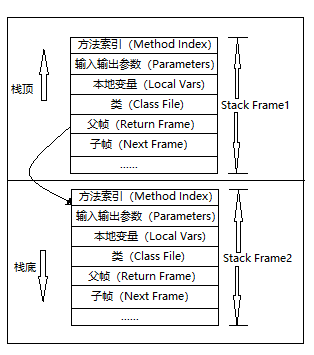
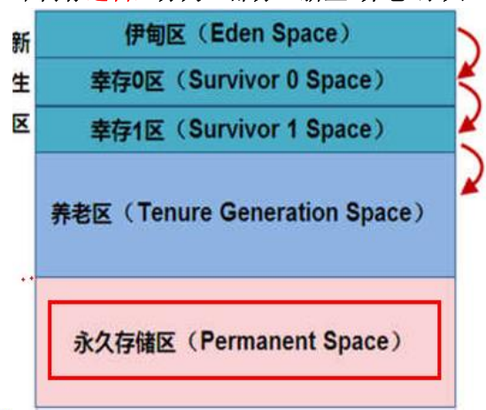
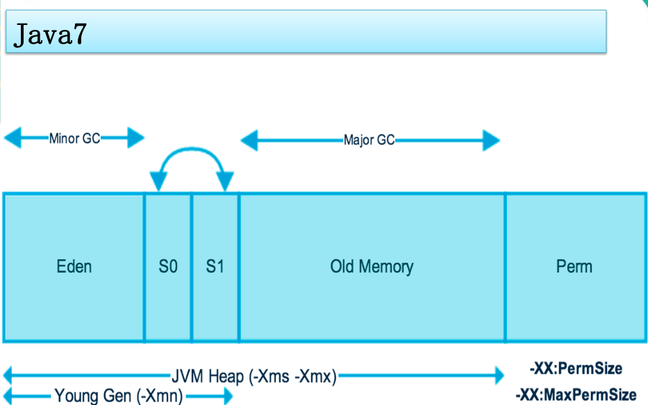
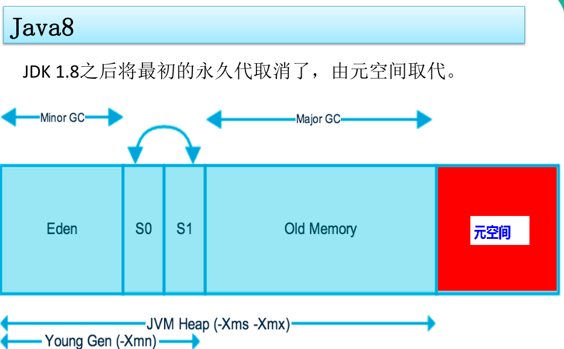

# JVM 知识总结

## 前言

对 JAVA 虚拟机相关知识的总结

## 一、JVM与操作系统的关系



JVM是运行在操作系统之上的，他与硬件没有直接的交互。可以说 JVM 就是运行在操作系统上的一个软件。

## 二、JVM体系结构概览



1. Class Loader类加载器

   负责加载class文件，class文件在文件开头有特定的文件标识，并且ClassLoader只负责class文件的加载。

2. Execution Engine执行引擎 负责解释命令，提交操作系统执行

3. Native Interface 本地接口

   Java语言本身不能对操作系统底层进行访问和操作，但是可以通过JNI接口调用其他语言来实现对底层的访问。

4. Native Method Stack 本地方法栈

   java在内存中专门开辟了一块区域处理标记为native的代码，他的具体做法是Native Method Stack中登记native方法，在Execution Engine执行时加载native libraies。

5. Runtime Data Area 运行数据区

6. Method Area方法区

   方法去是被所有线程共享，所有字段和方法字节码、以及一些特殊方法如构造函数，接口代码也在此定义。简单说，所有定义的方法的信息都保存在该区域，此区属于共享区间。用来保存装载的类的元结构信息。

   - 静态变量+常量+类信息+运行时常量池存放在**方法区**

   - 实例变量存在**堆内存**中

7. PC Register 程序计数器

   程序计数器是一块较小的内存空间，可以看作是当前线程所执行的字节码的行号指示器。**字节码解释器工作时通过改变这个计数器的值来选取下一条需要执行的字节码指令，分支、循环、跳转、异常处理、线程恢复等功能都需要依赖这个计数器来完成。**

   另外，**为了线程切换后能恢复到正确的执行位置，每条线程都需要有一个独立的程序计数器，各线程之间计数器互不影响，独立存储，我们称这类内存区域为“线程私有”的内存。**

   **从上面的介绍中我们知道程序计数器主要有两个作用：**

   1. 字节码解释器通过改变程序计数器来依次读取指令，从而实现代码的流程控制，如：顺序执行、选择、循环、异常处理。
   2. 在多线程的情况下，程序计数器用于记录当前线程执行的位置，从而当线程被切换回来的时候能够知道该线程上次运行到哪儿了。

   **注意：程序计数器是唯一一个不会出现 `OutOfMemoryError` 的内存区域，它的生命周期随着线程的创建而创建，随着线程的结束而死亡。**。

8. Java Stack 栈 ，后面详讲

9. heap 堆，后面详讲

   

## 三、栈（Stak）

**与程序计数器一样，Java 虚拟机栈也是线程私有的，它的生命周期和线程相同，随着线程的创建而创建，随着线程的死亡而死亡。描述的是 Java 方法执行的内存模型，每次方法调用的数据都是通过栈传递的。**

**Java 内存可以粗糙的区分为堆内存（Heap）和栈内存 (Stack),其中栈就是现在说的虚拟机栈，或者说是虚拟机栈中局部变量表部分。** （实际上，Java 虚拟机栈是由一个个栈帧组成，而每个栈帧中都拥有：局部变量表、操作数栈、动态链接、方法出口信息。）

**局部变量表主要存放了编译期可知的各种数据类型**（boolean、byte、char、short、int、float、long、double）、**对象引用**（reference 类型，它不同于对象本身，可能是一个指向对象起始地址的引用指针，也可能是指向一个代表对象的句柄或其他与此对象相关的位置）。

**Java 虚拟机栈会出现两种错误：`StackOverFlowError` 和 `OutOfMemoryError`。**

- **`StackOverFlowError`：** 若 Java 虚拟机栈的内存大小不允许动态扩展，那么当线程请求栈的深度超过当前 Java 虚拟机栈的最大深度的时候，就抛出 StackOverFlowError 错误。
- **`OutOfMemoryError`：** Java 虚拟机栈的内存大小可以动态扩展， 如果虚拟机在动态扩展栈时无法申请到足够的内存空间，则抛出`OutOfMemoryError`异常异常。

### 3.1 栈存储什么

**先进后出，后进先出即为栈**

栈帧中主要保存3类数据

- 局部变量表（Local Variables）：输入参数和输出参数以及方法内的变量；
- 操作数栈（Operand Stack）：记录出栈、入栈的操作；
- 栈帧数据（Frame Data）：方法描述，出口等。

### 3.2 栈运行原理

栈中的数据都是以栈帧（Stack Frame）的格式存在，栈帧是一个内存区块，是一个数据集，是一个有关方法（Method）和运行期数据的数据集，

当一个方法A被调用时就产生一个栈帧F1，并被压入到栈中，

A方法调用了B方法，于是产生栈帧F2也被压入到栈，

B方法调用了C方法，于是产生栈帧F3也被压入到栈。。。

执行完毕后，先弹出F3，再弹出F2，再弹出F1.。。。

遵循“先进后出/后进先出”的原则。



图示在一个栈中有两个栈：

栈2是最先被调用的方法，先入栈，

然后方法2调用了方法1，栈帧1处于栈顶的位置，

栈帧2处于栈底，执行完毕后，依次弹出栈帧1和栈帧2，

线程结束，栈释放。

**每执行一个方法都会产生一个栈帧，保存到栈（后进先出）的顶部，顶部栈就是当前的方法，该方法执行完毕后会自动将此栈帧出栈。**

### 3.3 三种JVM

1. Sun公司的HotSpot
2. BEA公司的JRockit
3. IBM公司的 J9 VM

## 四、堆（Heap）

### 4.1 堆内存示意图



### 4.2 新生区

新生区是类的诞生、成长、消亡的区域，一个类在这里产生，应用，最后被垃圾回收器收集，结束生命。新生区又分为两部分：伊甸区（Eden Space）和幸存者区（Survivor Space），所有的类都是再伊甸区被new出来。幸存区又分为两个个：0区和1区。当 Eden 区的空间用完时，程序有需要创建对象，JVM的垃圾回收器会对 Eden 区进行垃圾回收（Minor GC），将 Eden 区中的不再被其他对象所引用的对象（从 GCRoot 为根节点进行可达性分析）进行销毁。然后将 Eden 区中的未被回收的对象移动到幸存0区并将年龄加一，（当它的年龄增加到一定程度（默认为 15 岁），就会被晋升到老年代中。对象晋升到老年代的年龄阈值，可以通过参数 `-XX:MaxTenuringThreshold` 来设置。）若幸存0区也满了，再对该区进行垃圾回收，然后移动到1区。如果1区也满了，再移动到养老区。若养老区也满了，那么这时候将产生MajorGC（FullGC），进行养老区的内存清理。若养老区执行了FullGC后发现依然无法进行对象保存，就会产生OOM异常（OutOfMemoryError）。

- 如果出现`java.lang.OutOfMemoryError:Java heap space`异常，说明java虚拟机的堆内存不够。原因有二：

  1. Java虚拟机的对内存设置不够，可以通过参数-Xms、-Xmx来调整

     默认最大内存是机器的四分之一大小

  1. 代码中创建了大量大对象，并且长时间不能被垃圾收集器收集（存在被引用）
  
- OutOfMemoryError: GC Overhead Limit Exceeded ： 当JVM花太多时间执行垃圾回收并且只能回收很少的堆空间时，就会发生此错误。

### 4.3 养老区

养老区用于保存从新生区筛选出来的JAVA对象。

### 4.4 方法区

方法区与 Java 堆一样，是各个线程共享的内存区域，它用于存储已被虚拟机加载的类信息、常量、静态变量、即时编译器编译后的代码等数据。虽然 **Java 虚拟机规范把方法区描述为堆的一个逻辑部分**，但是它却有一个别名叫做 **Non-Heap（非堆）**，目的应该是与 Java 堆区分开来。

#### 4.4.1 方法区和永久代的关系

方法区也被称为永久代。《Java 虚拟机规范》只是规定了有方法区这么个概念和它的作用，并没有规定如何去实现它。那么，在不同的 JVM 上方法区的实现肯定是不同的了。 **方法区和永久代的关系很像 Java 中接口和类的关系，类实现了接口，而永久代就是 HotSpot 虚拟机对虚拟机规范中方法区的一种实现方式。** 也就是说，永久代是 HotSpot 的概念，方法区是 Java 虚拟机规范中的定义，是一种规范，而永久代是一种实现，一个是标准一个是实现，其他的虚拟机实现并没有永久代这一说法。

- 如果出现`java.lang.OutOfMemoryError:PermGen space`，说明是Java虚拟机对永久带Perm内存设置不够，一般出现这种情况，都是程序启动需要加载大量的第三方jar包。例如在一个Tomcat下部署了太多的应用。或者大量动态反射生成的类不断被加载，最终导致Perm区被沾满。
  - Jdk1.6之前：有永久代，常量值1.6在方法区
  - Jdk1.7：有永久代，但已经逐步“去永久代”，常量池1.7在堆
  - Jdk1.8之后：无永久代，常量池1.8在元空间

#### 4.4.2 常用参数

JDK 1.8 之前永久代还没被彻底移除的时候通常通过下面这些参数来调节方法区大小

```java
-XX:PermSize=N //方法区 (永久代) 初始大小
-XX:MaxPermSize=N //方法区 (永久代) 最大大小,超过这个值将会抛出 OutOfMemoryError 异常:java.lang.OutOfMemoryError: PermGen
```

相对而言，垃圾收集行为在这个区域是比较少出现的，但并非数据进入方法区后就“永久存在”了。

JDK 1.8 的时候，方法区（HotSpot 的永久代）被彻底移除了（JDK1.7 就已经开始了），取而代之是元空间，元空间使用的是直接内存。

下面是一些常用参数：

```java
-XX:MetaspaceSize=N //设置 Metaspace 的初始（和最小大小）
-XX:MaxMetaspaceSize=N //设置 Metaspace 的最大大小
```

与永久代很大的不同就是，如果不指定大小的话，随着更多类的创建，虚拟机会耗尽所有可用的系统内存。

#### 4.4.3 为什么要将永久代（PermGen）替换成元空间（MetaSpace）？

1. 整个永久代有一个 JVM 本身设置固定大小上限，无法进行调整，而元空间使用的是直接内存，受本机可用内存的限制，虽然元空间仍旧可能溢出，但是比原来出现的几率会更小。当元空间溢出时会得到如下错误： `java.lang.OutOfMemoryError: MetaSpace`

你可以使用 `-XX：MaxMetaspaceSize` 标志设置最大元空间大小，默认值为 unlimited，这意味着它只受系统内存的限制。`-XX：MetaspaceSize` 调整标志定义元空间的初始大小如果未指定此标志，则 Metaspace 将根据运行时的应用程序需求动态地重新调整大小。

2. 元空间里面存放的是类的元数据，这样加载多少类的元数据就不由 `MaxPermSize` 控制了, 而由系统的实际可用空间来控制，这样能加载的类就更多了。

3. 在 JDK8，合并 HotSpot 和 JRockit 的代码时, JRockit 从来没有一个叫永久代的东西, 合并之后就没有必要额外的设置这么一个永久代的地方了。

### 4.5 运行时常量池

运行时常量池是方法区的一部分。Class 文件中除了有类的版本、字段、方法、接口等描述信息外，还有常量池表（用于存放编译期生成的各种字面量和符号引用）

既然运行时常量池是方法区的一部分，自然受到方法区内存的限制，当常量池无法再申请到内存时会抛出 OutOfMemoryError 错误。

### 4.6 小总结

逻辑上堆由新生代、养老代、元空间构成、实际上堆只有新生和养老代；方法区就是永久代，永久代是方法区的实现

- 方法区（Method Area）和堆一样，是各个线程共享的内存区域，它用于存储虚拟机加载的类信息、普通常量、静态常量、编译器编译后的代码等，虽然JVM规范将方法去描述为堆的一个逻辑部分，但他却还有一个别名叫做Non-Heap（非堆），目的就是要和堆分开。
- 对于HotSpot虚拟机，很多开发者习惯将方法区成为“永久代”，但严格本质上说两者不同，或者说使用永久代来实现方法区而已，永久代是方法区（相当于一个接口Interface）的一个实现，JDK1.7的版本中，已经将原本放在永久代的字符串常量池移走。
- 常量池（Constant Pool）是方法区的一部分，Class文件除了有类的版本、字段、方法、接口等描述信息外，还有一项信息就是常量池，这部分内容将在类加载后进入方法区的运行时常量池中存放

## 五、JVM垃圾收集器（Java Garbage Collection）





### 5.1 堆内存调优简介

| -Xms                | 设置初始分配大小，默认为物理内存的“1/64” |
| ------------------- | ---------------------------------------- |
| -Xmx                | 最大分配内存，默认为物理内存的“1/4”      |
| -XX:+PrintGCDetails | 输出详细的GC处理日志                     |

## 七、GC三大算法

### 7.1 GC算法总体概述

JVM在进行GC时，并非每次都对上面三个内存区域一起回收的，大部分时候回收的都是指新生代。

因此GC按照回收的区域又分了两种类型，一种是普通GC（MinorGC），一种时全局GC（FullGC）

- 普通GC：只针对新生代区域的GC
- 全局GC：针对年老代的GC，偶尔伴随对新生代的GC以及堆永久代的GC。

### 7.2 复制算法

新生代使用的MinorGC（普通GC)，这种GC算法采用的是复制算法（Copying），频繁使用

复制-->清空-->互换

#### 7.2.1 原理

MinorGC会把Eden中的所有活着的对象都移到Survivor区域中，如果Survivor区中放不下，那么剩下的活的对象就被移到Old Generation中，也即一旦收集后，Eden区就变成空的了。

当对象在Eden（包括一个Survivor区域，这里假设是from区域）出生后，在经过一次MinorGC后，如果对象还存活，并且能够被另外一块Survivor区域所容纳（上面已经假设为from区域，这里应为to区域，即to区域有足够的内存空间来存储Eden和from区域中存活的对象），则使用复制算法将这些仍然还存活的对象复制到另外一块Survivor区域（即to区）中，然后清理所有使用过的Eden以及Survivor区域（即from区），并且讲这些对象的年龄设置为1，以后对象在Survivor区没熬过一次MinorGC，就将对象的年龄+1，当对象的年龄达到某个值时（默认15，通过`-XX：MaxTenuringThreshold`来设定参数），这些对象就会被存储到老年代。

-XX：MaxTenuringThreshold设置对象在新生代中存活的次数

#### 7.2.2 解释

HotSpot JVM把年轻代分为了三部分：1个Eden区和两个Survivor区，默认比例是8:1:1，一般情况下，新创建的对象都会被分配到Eden区，这些对象经过第一次的MinorGC后，如果仍然存活，将会被移到Survivor区。对象Survivor区中每熬过一次MinorGC，年龄就增加一岁，当他的年龄增加到一定程度时，就会被移动到年老代中。因为年轻代中的对象基本都是朝生夕死（80%以上），所以在年轻代的垃圾回收算法使用的是复制算法，复制算法的基本思想就是将内存分为两块，每次只用其中一块，当这一块内存用完，就将活着的对象复制到另外一块上面。复制算法不会产生内存碎片。

**复制要交换，谁空谁是to**

#### 7.2.3 劣势

复制算法弥补了标记清除算法中，内存布局混乱的缺点。

1. 浪费了一半的内存，太要命了
2. 如果对象的存活率很高，我们可以极端一点，假设是100%存活率，那么我们需要将所有对象都复制一遍，并将所有引用地址重置一遍。复制这一工作所花费的时间，在对象存活率达到一定程度是，将会变的不可忽视。所以从以上描述不难看出，复制算法想要使用，最起码对象的存活率要非常低才行，而且最重要的是，必须要克服50%的内存的浪费


### 7.3 标记清除/标记整理算法

老年代使用的FullGC（又叫MajorGC全局GC)一般是由标记清除或者是标记清除与标记整理的混合实现

#### 7.3.1 标记清除（Mark-Sweep)

##### 7.3.1.1 原理

1. 标记（mark）

   从根集合开始扫描，对存活的对象进行标记

2. 清除（Sweep）

   扫描整个内存空间，回收未被标记的对象，使用free-list记录可以使用的内存区域。

##### 7.3.1.2 劣势

1. 效率低（递归与全堆对象遍历），而且在进行GC的时候，需要停止应用程序，这会导致用户体验非常差劲
2. 清理出来的空闲内存不是连续的，我们的死亡对象都是随机的出现在内存的各个角落，GC把他们清除之后，内存的布局自然会乱七八糟，而为了应付这一点，JVM不得不维持一个内存的空闲列表，这又是一种开销，而且在分配数组对象的时候，寻找连续的内存空间会不太好找。

#### 7.3.2 标记整理（Mark-Compact)

##### 7.3.2.1 原理

1. 标记

   与标记-清除一样

2. 压缩整理

   再次扫描，并往一段滑动存活对象

##### 7.3.2.2 劣势

效率不高，不仅要标记所有存活对象，还要整理所有存活对象的引用地址。从效率上说，效率要低于复制算法

### 7.4 小总结

- **内存效率**：复制算法>标记清除算法>标记整理算法
- **内存整齐度**：复制算法=标记整理算法>标记清除算法
- **内存利用率**：标记整理算法=标记清除算法>复制算法

分代收集算法

引用计数法：

- 缺点：每次对对象赋值时均要维护引用计数器，且计数器本身也有一定的消耗
- 较难处理循环引用
