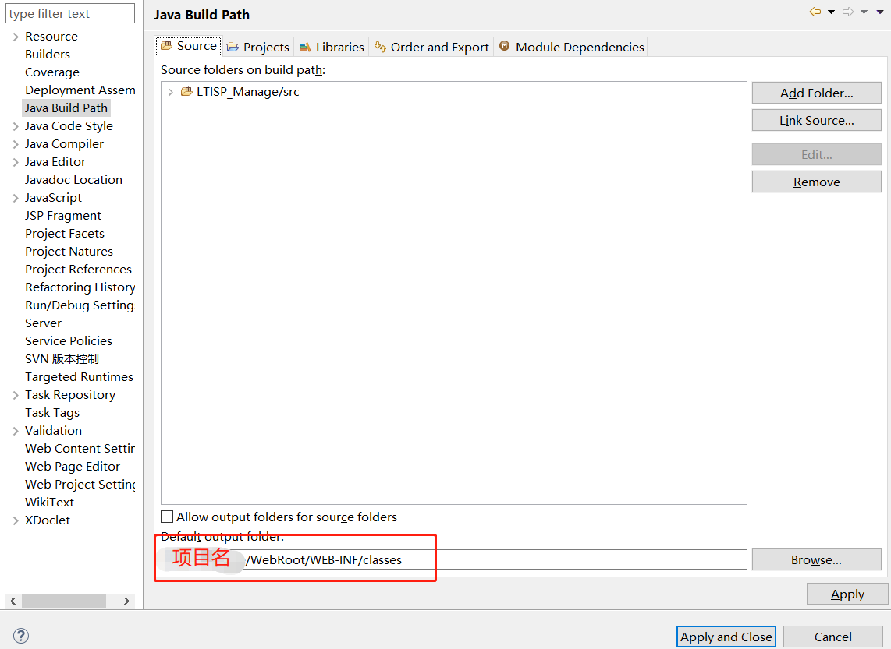

## 前言
在eclipse中导入web项目所需要的操作

## 一、 导入项目
1. 选择 File 中的 import
2. 选择 svn 中的从 svn 检出项目（本地项目就选 General -> Existing Projects into Workspace）

3. 选择作为工作空间的项目检出

## 二、 配置

1. build jar 包，右键 lib 文件夹下的jar包，点击 Build Path

2. 配置项目 右键项目-> properties -> Project Facets,勾选上 Dynamic Web Module

3. 选择 Java Build Path 添加 jre 和 Tomcat

4. 选择build路径

5. 设置打包内容 ，在 properties -> Deployment Assembly

6. 选择编译环境版本

## 三、 运行

1. 配置 servers,双击 servers下的Tomcat(若无法选择 Use Tomcat istallation 先将Tomcat下的项目全部删除，再右键Tomcat选择clean，清除安装包再试)

2. 添加项目，右键 Tomcat 点击 Add and Remove 

3. 发布到 webapp,右键 Tomcat，点击 publish

4. 启动 右键 Tomcat，点击 start

5. 访问： ip/端口：项目名/