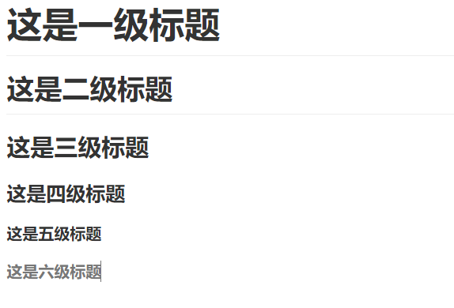

## 前言
本篇博客讲述Markdown的基本语法

## 一、标题
示例：
```
# 这是一级标题
## 这是二级标题
### 这是三级标题
#### 这是四级标题
##### 这是五级标题
###### 这是六级标题
```
效果：



## 二、字体
- 加粗
要加粗的文字左右分别用两个*号包起来

- 斜体
要倾斜的文字左右分别用一个*号包起来

- 斜体加粗
要倾斜和加粗的文字左右分别用三个*号包起来

- 删除线
要加删除线的文字左右分别用两个~~号包起来

示例：
```
**这是加粗的文字**
*这是倾斜的文字*`
***这是斜体加粗的文字***
~~这是加删除线的文字~~
```
效果：
**这是加粗的文字**
*这是倾斜的文字*`
***这是斜体加粗的文字***
~~这是加删除线的文字~~

## 三、引用
在引用的文字前加>即可。引用也可以嵌套，如加两个>>三个>>>
示例：
```
>这是引用的内容
>>这是引用的内容
>>>>>>>>>>这是引用的内容
```
>这是引用的内容
>>这是引用的内容
>>>>>>>>>>这是引用的内容

## 四、分割线
三个或者三个以上的 - 或者 * 都可以
示例：
```
---
----
***
*****

```
---
----
***
*****

## 五、图片
语法：
```


图片alt就是显示在图片下面的文字，相当于对图片内容的解释。
图片title是图片的标题，当鼠标移到图片上时显示的内容。title可加可不加
```
示例：
```

```
效果：


## 六、超链接
语法：
```java
[超链接名](超链接地址 "超链接title")
title可加可不加
```
示例：
```
[百度](http://baidu.com)
```
效果：
[百度](http://baidu.com)

## 七、列表
**无序列表**
语法：
无序列表用 - + * 任何一种都可以
示例：
```
- 列表内容
+ 列表内容
* 列表内容

注意：- + * 跟内容之间都要有一个空格
```
效果如下：
- 列表内容
+ 列表内容
* 列表内容

**有序列表**
语法：
数字加点
示例：
```
1. 列表内容
2. 列表内容
3. 列表内容
```
效果如下：
1. 列表内容
2. 列表内容
3. 列表内容

**列表嵌套**
上一级和下一级之间敲三个空格即可
示例：
```
- 一级无序列表内容
   - 二级无序列表内容
   - 二级无序列表内容
   - 二级无序列表内容
- 一级无序列表内容
   1. 二级有序列表内容
   2. 二级有序列表内容
   2. 二级有序列表内容
1. 一级有序列表内容
   - 二级无序列表内容
   - 二级无序列表内容
   - 二级无序列表内容
2. 一级有序列表内容
   1. 二级有序列表内容
   2. 二级有序列表内容
   3. 二级有序列表内容
```
效果：
- 一级无序列表内容
   - 二级无序列表内容
   - 二级无序列表内容
   - 二级无序列表内容
- 一级无序列表内容
   1. 二级有序列表内容
   2. 二级有序列表内容
   2. 二级有序列表内容
1. 一级有序列表内容
   - 二级无序列表内容
   - 二级无序列表内容
   - 二级无序列表内容
2. 一级有序列表内容
   1. 二级有序列表内容
   2. 二级有序列表内容
   3. 二级有序列表内容

## 八、表格
语法：
```java
|表头|表头|表头|
|---|:--:|---:|
|内容|内容|内容|
|内容|内容|内容|

第二行分割表头和内容。
- 有一个就行，为了对齐，多加了几个
文字默认居左
-两边加：表示文字居中
-右边加：表示文字居右
-左边加：表示文字居左
```
示例：
```
| Left-aligned | Center-aligned | Right-aligned |
| :---         |     :---:      |          ---: |
| git status   | git status     | git status    |
| git diff     | git diff       | git diff      |
```
效果：
| Left-aligned | Center-aligned | Right-aligned |
| :---         |     :---:      |          ---: |
| git status   | git status     | git status    |
| git diff     | git diff       | git diff      |

## 九、代码
语法：
单行代码：代码之间分别用一个反引号包起来
```
`代码内容`
```
代码块：代码之间分别用三个反引号包起来，且两边的反引号单独占一行,在第三个访问号后面可以跟上语言
示例：
```java
public class Singleton {

    private static volatile Singleton instance;

    private Singleton(){ }

    public Singleton getInstance(){
        if (instance == null){
            synchronized (Singleton.class){
                if (instance == null){
                    instance = new Singleton();
                }
            }
        }
        return instance;
    }
}
```
## 十、流程图
示例：
```
st=>start: 开始
op=>operation: My Operation
cond=>condition: Yes or No?
e=>end
st->op->cond
cond(yes)->e
cond(no)->op
```
效果：

```flow
st=>start: 开始
op=>operation: My Operation
cond=>condition: Yes or No?
e=>end
st->op->cond
cond(yes)->e
cond(no)->op
```
**说明**
流程图大致分为两段，第一段是定义元素，第二段是定义元素之间的走向。
**定义元素的语法**
```
tag=>type: content:>url
```
- tag就是元素名字，
- type是这个元素的类型，有6中类型，分别为：
   1. start, 开始
   2. end, 结束
   3. operation, 操作
   4. subroutine, 子程序
   5. condition, 条件
   6. inputoutput, 输入或产出
- content,就是在框中要写的内容，注意type后的冒号与文本之间一定要有个空格
- url是一个连接，与框中的文本相绑定

**连接元素的语法**
用->来连接两个元素，需要注意的是condition类型，因为他有yes和no两个分支，所以要写成:

```
cond(yes)->e
cond(no)->op
```
## 十一、HTML标签

在Markdown语法中也支持使用HTML标签
示例：
```html
<font color='red'> hello Markdown </font>
``` 
效果：
<font color='red'> hello Markdown </font>