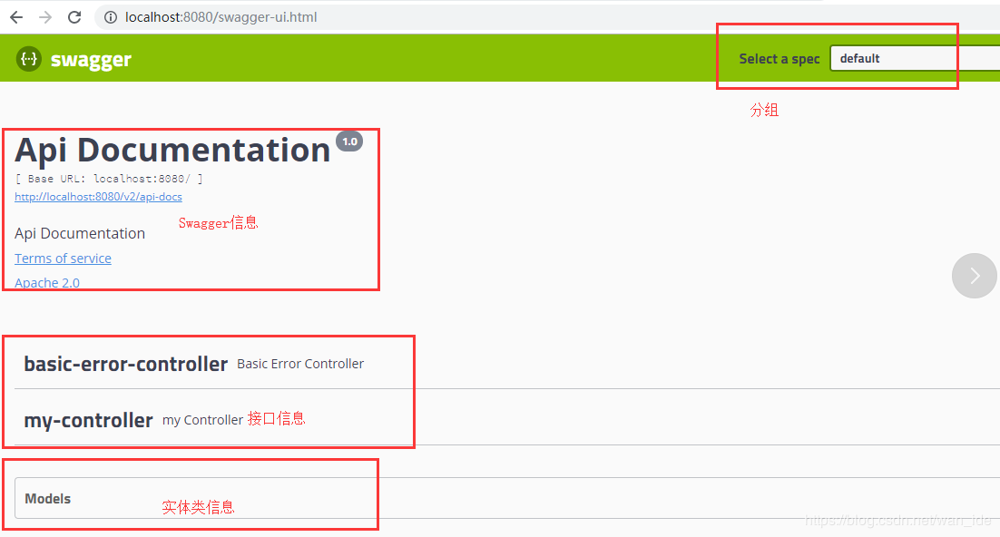
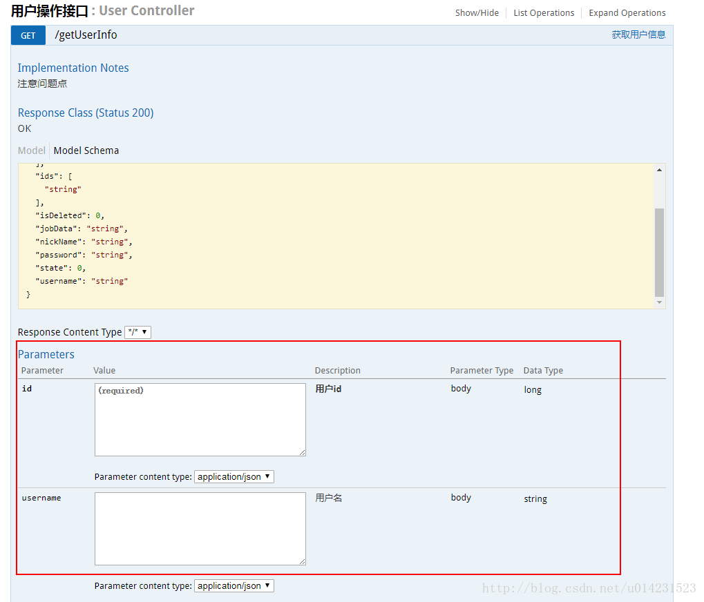
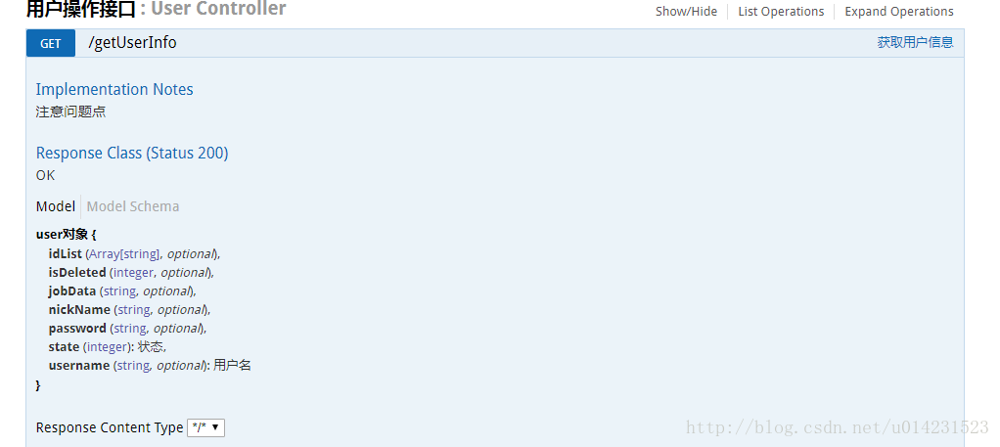
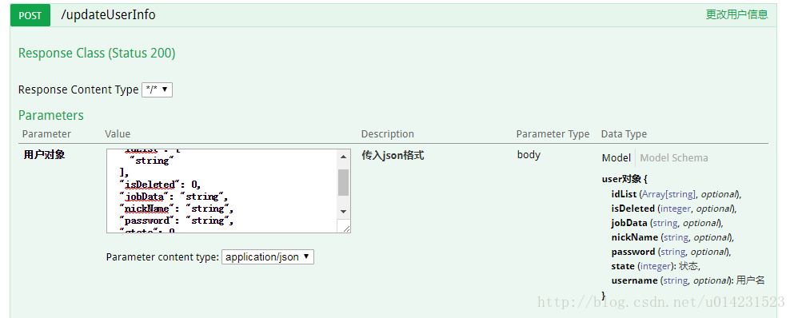
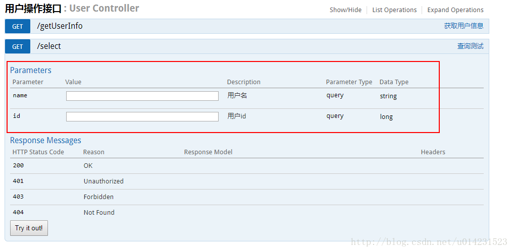

## 前言
本篇博客为在SpringBoot中配置 Swagger,以及Swagger常用的命令的整理。

## 什么是Swagger？
Swagger其实就是我们前后端分离时来实现前后端开发的信息及时更新Api的一个框架，是前后端的唯一联系。比如我们后端写了一些controller接口，前端就能通过访问swagger-ui来及时的查看到。

**Swagger的页面主要有四个部分：**

- Swagger信息：开发者的一些信息什么的。
- 接口信息：我们后端写的controller接口的信息。
- 实体类信息：就是实体类信息啦，不过只有在controller中返回值有实体类的才会有显示。
- 分组：对应着一个个的Docket。


## Swagger的使用
1. 导入依赖
```java
<dependency>
    <groupId>io.springfox</groupId>
    <artifactId>springfox-swagger2</artifactId>
    <version>2.9.2</version>
</dependency>
<dependency>
    <groupId>io.springfox</groupId>
    <artifactId>springfox-swagger-ui</artifactId>
    <version>2.9.2</version>
</dependency>
```
2. 配置Swagger
**在SwaggerConfig中配置Swagger的基本信息：**
```java
​
package com.lyr.swagger.config;
 
import org.springframework.context.annotation.Bean;
import org.springframework.context.annotation.Configuration;
import springfox.documentation.service.ApiInfo;
import springfox.documentation.service.Contact;
import springfox.documentation.spi.DocumentationType;
import springfox.documentation.spring.web.plugins.Docket;
import springfox.documentation.swagger2.annotations.EnableSwagger2;
 
import java.util.ArrayList;
 
import static springfox.documentation.service.ApiInfo.DEFAULT_CONTACT;
 
@Configuration
@EnableSwagger2   //开启Swagger2
public class SwaggerConfig {
    //配置了Swagger的Docket的bean实例
    @Bean
    public Docket docket(){
        return new Docket(DocumentationType.SWAGGER_2)
                .apiInfo(apiInfo())
                //.enable(false)  是否启动Swagger
                .enable(flag)
                .select()
                //RequestHandlerSelectors 配置要扫描接口的方式
                //basePackage：指定要扫描的包
                //any()：描述全部
                //none()：不扫描
                //withClassAnnotation：扫描类上的注解，参数是一个注解的反射对象
                //withMethodAnnotation：描述方法的注解
                //.apis(RequestHandlerSelectors.withMethodAnnotation(RequestMapping.class))
                .apis(RequestHandlerSelectors.basePackage("com.lyr.swagger.controller"))
                //paths() 过滤扫描路径
                //.paths(PathSelectors.ant("/lyr/**"))
                .build();
    }
 
    //配置Swagger信息
    private ApiInfo apiInfo(){
//           	return new ApiInfoBuilder()
//    			.title("Project API Doc")
//    			.description("This is a restful api document of Project.")
//    			.version("1.0")
//    			.build();
        return new ApiInfoBuilder().build();
    }
}
```
## Swagger常用注解
```
- @Api()用于类； 
表示标识这个类是swagger的资源 
- @ApiOperation()用于方法； 
表示一个http请求的操作 
- @ApiParam()用于方法，参数，字段说明； 
表示对参数的添加元数据（说明或是否必填等） 
- @ApiModel()用于类 
表示对类进行说明，用于参数用实体类接收 
- @ApiModelProperty()用于方法，字段 
表示对model属性的说明或者数据操作更改 
- @ApiIgnore()用于类，方法，方法参数 
表示这个方法或者类被忽略 
- @ApiImplicitParam() 用于方法 
表示单独的请求参数 
- @ApiImplicitParams() 用于方法，包含多个 @ApiImplicitParam
```
### @Api()
用于类；表示标识这个类是swagger的资源。 
tags –表示说明 
value –也是说明，可以使用tags替代
```java
@Api(value="用户controller",tags={"用户操作接口"})
@RestController
public class UserController {

}
```
### @ApiOperation()
用于方法；表示一个http请求的操作 
value -用于方法描述 
notes -用于提示内容 
tags -可以重新分组
### ApiParam()
用于方法，参数，字段说明；表示对参数的添加元数据（说明或是否必填等） 
name –参数名 
value –参数说明 
required –是否必填
```java
@Api(value="用户controller",tags={"用户操作接口"})
@RestController
public class UserController {
     @ApiOperation(value="获取用户信息",tags={"获取用户信息copy"},notes="注意问题点")
     @GetMapping("/getUserInfo")
     public User getUserInfo(@ApiParam(name="id",value="用户id",required=true) Long id,@ApiParam(name="username",value="用户名") String username) {
     // userService可忽略，是业务逻辑
      User user = userService.getUserInfo();
      return user;
  }
}
```
效果图：

### @ApiModel()
用于类,表示对类进行说明，用于参数用实体类接收 
value –表示对象名 
description –描述 
### @ApiModelProperty()
用于方法，字段,表示对model属性的说明或者数据操作更改 
value –字段说明 
name –重写属性名字 
dataType –重写属性类型 
required –是否必填 
example –举例说明 
hidden –隐藏

```java
@ApiModel(value="user对象",description="用户对象user")
public class User implements Serializable{
    private static final long serialVersionUID = 1L;
     @ApiModelProperty(value="用户名",name="username",example="xingguo")
     private String username;
     @ApiModelProperty(value="状态",name="state",required=true)
      private Integer state;
      private String password;
      private String nickName;
      private Integer isDeleted;
 
      @ApiModelProperty(value="id数组",hidden=true)
      private String[] ids;
      private List<String> idList;
     //省略get、set
}
```
```java
  @ApiOperation("更改用户信息")
  @PostMapping("/updateUserInfo")
  public int updateUserInfo(@RequestBody @ApiParam(name="用户对象",value="传入json格式",required=true) User user){
 
     int num = userService.updateUserInfo(user);
     return num;
  }
```
效果图：


### @ApiIgnore()
用于类或者方法上，可以不被swagger显示在页面上
### @ApiImplicitParam() 
用于方法,表示单独的请求参数 
### @ApiImplicitParams()
用于方法，包含多个 @ApiImplicitParam 
name –参数ming 
value –参数说明 
dataType –数据类型 
paramType –参数类型 
example –举例说明

```java
  @ApiOperation("查询测试")
  @GetMapping("select")
  //@ApiImplicitParam(name="name",value="用户名",dataType="String", paramType = "query")
  @ApiImplicitParams({
  @ApiImplicitParam(name="name",value="用户名",dataType="string", paramType = "query",example="xingguo"),
  @ApiImplicitParam(name="id",value="用户id",dataType="long", paramType = "query")})
  public void select(){
  }
```
效果图：

