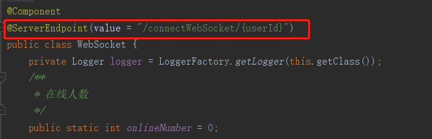
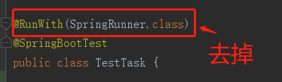

## 前言
spring boot 运行测试类时出现：Error creating bean with name 'serverEndpointExporter' 错误，记录解决方法。

## 产生原因
websocket是需要依赖tomcat等容器的启动。所以在测试过程中我们要真正的启动一个tomcat作为容器，不然会报错。


就是这个注解出现问题

## 解决方法

1. 将 @RunWith(SpringRunner.class) 去掉即可,但是这种方式会有局限，比如下方你要@Authwired一个类的时候会报错。



2. 在SpringBootTest后加上 (webEnvironment = SpringBootTest.WebEnvironment.RANDOM_PORT) 即可

```java
@RunWith(SpringRunner.class)
@SpringBootTest(webEnvironment = SpringBootTest.WebEnvironment.RANDOM_PORT)
public class TestTask {

}

```
