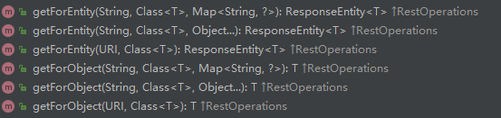
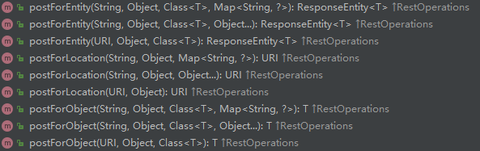

## 前言
本篇博客为对RestTemplate总结

## HttpURLConnection
在讲RestTemplate之前我们来看看再没有RestTemplate之前是怎么发送http请求的。
```java
private String httpRequest(String api){
        BufferedReader in = null;
        StringBuffer result;
        try {
            URL url = new URL(api);
            //打开和url之间的连接
            HttpURLConnection connection = (HttpURLConnection) url.openConnection();
            connection.setRequestProperty("Content-Type", "application/x-www-form-urlencoded");
            connection.setRequestProperty("Charset", "utf-8");
            connection.connect();
            result = new StringBuffer();
            //读取URL的响应
            in = new BufferedReader(new InputStreamReader(connection.getInputStream()));
            String line;
            while ((line = in.readLine()) != null) {
                result.append(line);
            }
            return result.toString(); //返回json字符串
        } catch (MalformedURLException e) {
            e.printStackTrace();
        } catch (IOException e) {
            e.printStackTrace();
        } finally {
            try {
                if (in != null) {
                    in.close();
                }
            } catch (IOException e) {
                e.printStackTrace();
            }

        }
        return null;
    }
```
可以看到需要使用HttpURLConnection去打开连接，然后再设置一堆请求参数，通过流读取URL的响应结果后还要遍历流封装数据，最后还要关闭连接，可谓非常繁琐。如果使用RestTemplate发送同样的一个请求的话，只需要一步：
```java
String str = restTemplate.getForObject(api,String.class);
```
跟进RestTemplate源码，可以看到RestTemplate底层就是对HttpURLConnection的封装，帮我们解决了那些繁琐的过程
```java
@Override
	public ClientHttpRequest createRequest(URI uri, HttpMethod httpMethod) throws IOException {
		HttpURLConnection connection = openConnection(uri.toURL(), this.proxy);
		prepareConnection(connection, httpMethod.name());

		if (this.bufferRequestBody) {
			return new SimpleBufferingClientHttpRequest(connection, this.outputStreaming);
		}
		else {
			return new SimpleStreamingClientHttpRequest(connection, this.chunkSize, this.outputStreaming);
		}
	}
```

## RestTemplate简介
RestTemplate 是从 Spring3.0 开始支持的一个 HTTP 请求工具，它提供了常见的REST请求方案的模版，例如 GET 请求、POST 请求、PUT 请求、DELETE 请求以及一些通用的请求执行方法 exchange 以及 execute。RestTemplate 继承自 InterceptingHttpAccessor 并且实现了 RestOperations 接口，其中 RestOperations 接口定义了基本的 RESTful 操作，这些操作在 RestTemplate 中都得到了实现。说白了RestTemplate就是Spring提供的一个访问Http服务的客户端类，在微服务之间的调用，接口调用就需要使用的RestTemplate

## Get请求

可以看到，使用RestTemplate发送get请求主要有两类方法，分别是getForEntity和getForObject，两类方法又分别有三个重载方法，接下来我们看看这两个方法。

### getForEntity
getForEntity返回类型是ResponseEntity<T>，也就是说如果开发者需要获取响应头的话，那么就需要使用 getForEntity 来发送 HTTP 请求，此时返回的对象是一个 ResponseEntity 的实例。这个实例中包含了响应数据以及响应头。看下它的三个重载方法：
```java
@Override
	public <T> ResponseEntity<T> getForEntity(String url, Class<T> responseType, Object... uriVariables)
			throws RestClientException {

		RequestCallback requestCallback = acceptHeaderRequestCallback(responseType);
		ResponseExtractor<ResponseEntity<T>> responseExtractor = responseEntityExtractor(responseType);
		return nonNull(execute(url, HttpMethod.GET, requestCallback, responseExtractor, uriVariables));
	}

	@Override
	public <T> ResponseEntity<T> getForEntity(String url, Class<T> responseType, Map<String, ?> uriVariables)
			throws RestClientException {

		RequestCallback requestCallback = acceptHeaderRequestCallback(responseType);
		ResponseExtractor<ResponseEntity<T>> responseExtractor = responseEntityExtractor(responseType);
		return nonNull(execute(url, HttpMethod.GET, requestCallback, responseExtractor, uriVariables));
	}

	@Override
	public <T> ResponseEntity<T> getForEntity(URI url, Class<T> responseType) throws RestClientException {
		RequestCallback requestCallback = acceptHeaderRequestCallback(responseType);
		ResponseExtractor<ResponseEntity<T>> responseExtractor = responseEntityExtractor(responseType);
		return nonNull(execute(url, HttpMethod.GET, requestCallback, responseExtractor));
	}
```
可以看到有两个必填的参数，第一个参数是请求接口的url，第二个参数是响应结果中响应体的类型。第三是选填的参数，http请求携带的参数，有两种类型，一种是以map的形式，另一种则为占位符的格式，类似于sql中的占位符。
```java
  private JSONObject sendGetRequest(Map<String,Object> map){
        
         ResponseEntity<String> responseEntity = restTemplate.getForEntity(url, String.class, map); 
        return JSONObject.parseObject(json);
    }
```
```java
 String url = "http://" + host + ":" + port + "/sayHello?name={1}&sex={2}";
        ResponseEntity<String> responseEntity = restTemplate.getForEntity(url, String.class, name,sex); 
```
当然我们也可以直接在url后面拼接参数。
```java
  private JSONObject sendGetRequest(Map<String,Object> map){
        StringBuilder accessRequestUrl = new StringBuilder(cspProperties.getUrl() + "?");
        Set<String> keys = map.keySet();
        List<String> list = new ArrayList<>(keys);
        for (String key : list) {
            accessRequestUrl.append(key).append("=").append(map.get(key).toString()).append("&");
        }
        accessRequestUrl.subSequence(0,accessRequestUrl.length() - 1);

        ResponseEntity<String> json = restTemplate.getForEntity(accessRequestUrl.toString(),String.class);
        return JSONObject.parseObject(json);
    }
```
### getForObject
getForObject和getForEntity类似，唯一的区别就是getForObject返回参数就是接口返回的数据，它不会返回响应头等信息。如果只关心数据本身而不关心响应头等信息就可以使用该方法。
```java
@Override
	@Nullable
	public <T> T getForObject(String url, Class<T> responseType, Object... uriVariables) throws RestClientException {
		RequestCallback requestCallback = acceptHeaderRequestCallback(responseType);
		HttpMessageConverterExtractor<T> responseExtractor =
				new HttpMessageConverterExtractor<>(responseType, getMessageConverters(), logger);
		return execute(url, HttpMethod.GET, requestCallback, responseExtractor, uriVariables);
	}

	@Override
	@Nullable
	public <T> T getForObject(String url, Class<T> responseType, Map<String, ?> uriVariables) throws RestClientException {
		RequestCallback requestCallback = acceptHeaderRequestCallback(responseType);
		HttpMessageConverterExtractor<T> responseExtractor =
				new HttpMessageConverterExtractor<>(responseType, getMessageConverters(), logger);
		return execute(url, HttpMethod.GET, requestCallback, responseExtractor, uriVariables);
	}

	@Override
	@Nullable
	public <T> T getForObject(URI url, Class<T> responseType) throws RestClientException {
		RequestCallback requestCallback = acceptHeaderRequestCallback(responseType);
		HttpMessageConverterExtractor<T> responseExtractor =
				new HttpMessageConverterExtractor<>(responseType, getMessageConverters(), logger);
		return execute(url, HttpMethod.GET, requestCallback, responseExtractor);
	}

```
## POST 请求

post 请求的方法类型除了 postForEntity 和 postForObject 之外，还有一个 postForLocation。这里的方法类型虽然有三种，但是这三种方法重载的参数基本是一样的。

### postForEntity
```java
@Override
	public <T> ResponseEntity<T> postForEntity(String url, @Nullable Object request,
			Class<T> responseType, Object... uriVariables) throws RestClientException {

		RequestCallback requestCallback = httpEntityCallback(request, responseType);
		ResponseExtractor<ResponseEntity<T>> responseExtractor = responseEntityExtractor(responseType);
		return nonNull(execute(url, HttpMethod.POST, requestCallback, responseExtractor, uriVariables));
	}

	@Override
	public <T> ResponseEntity<T> postForEntity(String url, @Nullable Object request,
			Class<T> responseType, Map<String, ?> uriVariables) throws RestClientException {

		RequestCallback requestCallback = httpEntityCallback(request, responseType);
		ResponseExtractor<ResponseEntity<T>> responseExtractor = responseEntityExtractor(responseType);
		return nonNull(execute(url, HttpMethod.POST, requestCallback, responseExtractor, uriVariables));
	}

	@Override
	public <T> ResponseEntity<T> postForEntity(URI url, @Nullable Object request, Class<T> responseType)
			throws RestClientException {

		RequestCallback requestCallback = httpEntityCallback(request, responseType);
		ResponseExtractor<ResponseEntity<T>> responseExtractor = responseEntityExtractor(responseType);
		return nonNull(execute(url, HttpMethod.POST, requestCallback, responseExtractor));
	}

```
post中的postForEntity和postForObject返回类型和get方法一样，这里就不叙述，我们来看看参数。其它参数没啥好说的，上面都提到了，可以看出出现了一个新的参数 Object request，这个是什么？跟进源码：
```java

		public HttpEntityRequestCallback(@Nullable Object requestBody, @Nullable Type responseType) {
			super(responseType); // requestBody 就是 request参数
			if (requestBody instanceof HttpEntity) {
				this.requestEntity = (HttpEntity<?>) requestBody;
			}
			else if (requestBody != null) {
				this.requestEntity = new HttpEntity<>(requestBody);
			}
			else {
				this.requestEntity = HttpEntity.EMPTY;
			}
		}
```
可以看到，request是一个HttpEntity类型，HttpEntity其实相当于一个消息实体，内容是http传送的报文（主要是json文件）。这里只需要知道它是用来表征一个http报文的实体就行了，用来发送或接收。举个例子：
```java
 private JSONObject sendPostRequest(Map<String,String> map){

        HttpHeaders headers = new HttpHeaders();
        headers.set("Content-Type","application/json;charset=UTF-8");
        headers.set("Accept","application/json");
        headers.set("Accept-Encoding","");
        String url = osyProperties.getUrl();
        Map<String,Object> requestMessage = new HashMap<>();

        // 请求报文头参数
        Map<String, Object> head = getRequestHeadersParams();
        requestMessage.put("head",head);

        // 请求报文体参数
        HashMap<String, Map<String,String>> body = new HashMap<>();
        requestMessage.put("body",map);

        HttpEntity<Map<String, Object>> request = new HttpEntity<>(requestMessage, headers);
        ResponseEntity<String> entity = restTemplate.postForEntity(url, request, String.class);
        System.out.println(entity);
        String body = entity.getBody();
        return JSONObject.parseObject(body);
    }
```
上面代码发送的报文形式如下（json格式，接口的参数应对应也是json接受，即参数前加上     @RequestBody注解）：
```json
{
	"head": {
			报文头参数：值
	    },
	"body": {
	 		报文体参数：值
		}
	},
}
```

HttpEntity实例化的源码
```java
public HttpEntity(@Nullable T body, @Nullable MultiValueMap<String, String> headers) {
		this.body = body;
		HttpHeaders tempHeaders = new HttpHeaders();
		if (headers != null) {
			tempHeaders.putAll(headers);
		}
		this.headers = HttpHeaders.readOnlyHttpHeaders(tempHeaders);
	}
```
### postForObject
postForObject和postForEntity就是返回类型不同。

### postForLocation
postForLocation 方法的返回值是一个 Uri 对象，因为 POST 请求一般用来添加数据，有的时候需要将刚刚添加成功的数据的 URL 返回来，此时就可以使用这个方法，一个常见的使用场景如用户注册功能，用户注册成功之后，可能就自动跳转到登录页面了，此时就可以使用该方法。例如在 provider 中提供一个用户注册接口，再提供一个用户登录接口，如下：
```java
@RequestMapping("/register")
public String register(User user) throws UnsupportedEncodingException {
    return "redirect:/loginPage?username=" + URLEncoder.encode(user.getUsername(),"UTF-8") + "&address=" + URLEncoder.encode(user.getAddress(),"UTF-8");
}
@GetMapping("/loginPage")
@ResponseBody
public String loginPage(User user) {
    return "username:" + user.getUsername();
}
```
这里一个注册接口，一个是登录页面，不过这里的登录页面我就简单用一个字符串代替了。然后在 consumer 中来调用注册接口，如下：
```java
@GetMapping("/hello")
public String sayHello() {
    List<ServiceInstance> list = discoveryClient.getInstances("provider");
    ServiceInstance instance = list.get(0);
    String host = instance.getHost();
    int port = instance.getPort();
    String url = "http://" + host + ":" + port + "/register";
    MultiValueMap map = new LinkedMultiValueMap();
    map.add("username", "dave");
    URI uri = restTemplate.postForLocation(url, map);
    String s = restTemplate.getForObject(uri, String.class);
    return s;
}
```
这里首先调用 postForLocation 获取 Uri 地址，然后再利用 getForObject 请求 Uri，界面结果为：username:dave。
注意：postForLocation 方法返回的 Uri 实际上是指响应头的 Location 字段，所以，provider 中 register 接口的响应头必须要有 Location 字段（即请求的接口实际上是一个重定向的接口），否则 postForLocation 方法的返回值为null。
