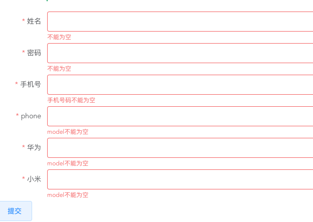

## 前言
本文对vue的ui框架elementUI表单校验的总结

## 嵌套对象的校验
项目中使用vue + elementUI开发项目有段时间了，前端校验绕不开的就是校验。在elementUI表单中提供了 :rules进行校验，:model绑定的数据必须是对象，那么当对象的数据结构比较复杂时该怎么校验？

### 例子
```html
<template>
  <el-form :model="formData" :rules="formRule" ref="formData" label-width="100px">
        <el-form-item prop="name" label="姓名">
            <el-input v-model="formData.name" ></el-input>
        </el-form-item>
        <el-form-item prop="password" label="密码">
          <el-input v-model="formData.password" ></el-input>
        </el-form-item>
        <el-form-item prop="user.tel" label="手机号" >
          <el-input v-model="formData.user.tel" ></el-input>
        </el-form-item>
        <el-form-item prop="phones[0].model" label="手机号">
          <el-input v-model="formData.phones[0].model"></el-input>
        </el-form-item>
        <el-form-item v-for="(phone, index) in formData.phones" :label="phone.brand" :key="phone.brand" :prop="'phones.' + index + '.model'" :rules="{
         required: true, message: 'model不能为空', trigger: 'blur'
         }">
            <el-input v-model="phone.model"></el-input>
            <el-form :model="formData.phones[index]" label-width="100px">
                 <el-form-item v-for="(item, index1) in formData.phones[index].arr" :key="index1" :prop="'arr.' + index1 +  '.data1'" label="data1" :rules="{
                 required: true, message: 'data1不能为空', trigger: 'blur'
                 }">
                     <el-input v-model="item.data1"></el-input>
                 </el-form-item>
           </el-form>
        </el-form-item>
    </el-form>
    <el-button @click="handleSubmit">提交</el-button>    
</template>
```
```javascript
data () {
    return {
      formData:{
          name: '',
          password: '',
          user: {
              tel: ''
          },
           phones: [
              { brand: "华为", model: "", arr: [{ data1: "" }] },
              { brand: "小米", model: "", arr: [{ data1: "" }] }
          ] 
      },
      formRule:{
        name: [{required: true, message: '不能为空', trigger: 'blur'},
                {pattern: /^[\u4E00-\u9FA5]+$/, message: '用户名只能为中文', trigger: 'blur'}],
        password: [{required: true, message: '不能为空', trigger: 'blur'},
          {validator: Verify.validatePassword, trigger: 'blur'},
        ],
        'user.tel' : [{required: true, message: '手机号码不能为空', trigger: 'blur'}],
        'phones[0].model': [{required: true, message: 'model不能为空', trigger: 'blur'}],
      },
    }
  },

methods: {
    handleSubmit(){
        const t = this;
        t.$refs['formData'].validate((valid) => {
            if(valid){
              console.log(this.formData);
            }
        })
    }
  }
```
### 校验方法
model 绑定的 formData 中内层 user 也是一个对象，现在想要对tel进行校验，在prop中传递user.tel，并且在rules中也要指定user.tel即可。

对于子对象里面又嵌套数组的数据结构，如果想校验数组里的元素，需要在写一层form，用子对象作为新form表单再重新走一遍流程即可，具体例子请看上面的代码

对于验证规则，可以通过pattern或者validator来实现，pattern里面可以直接写正则表达式，不知道为啥文档中没有提到这点。之前的验证一般都是通过validator来实现的，验证方法单独写在一个文件中，这样可以做到整个项目公用，用到时只需通过import引一下即可。

### 校验效果
