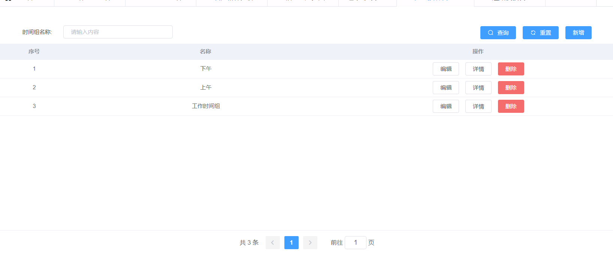
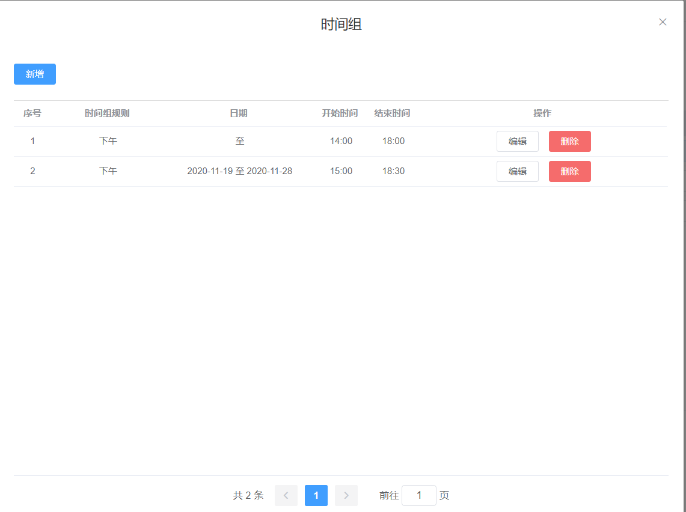
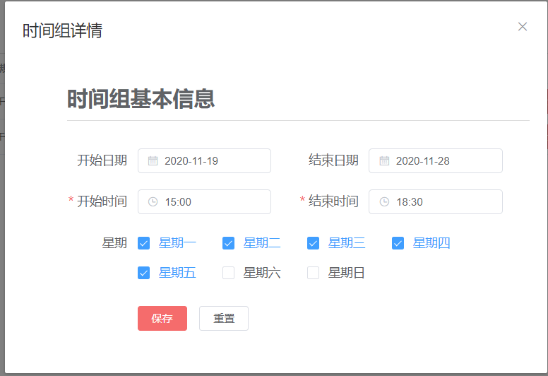
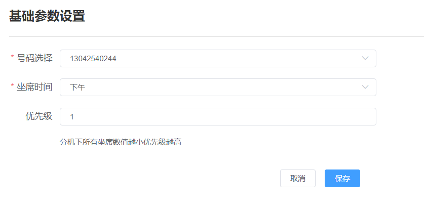

## 前言

项目有个需求：每个企业号码可以在不同的时间段绑定不同的号码，即每个企业号码可绑定多个号码，每个号码绑定一个对应的时间组，每个时间组里可以有多个时间规则，计算出企业号每天每个时间段应绑定的号码并记录在企业号排班记录表中，时间段冲突部分根据优先级选取改时间段绑定的号码

## 示例

1.时间组



2.时间组详情列表



3.时间组详情



注：
1. 开始时间和结束时间必填
2. 未选开始日期或开始日期小于当前日期则开始日期为当天日期
3. 未选结束日期默认结束日期为一个月后，一个月后若结束日期未改则有定时任务再生成一个月的数据
4. 星期未选则为每天

4.企业号排班设置



## 分析

在每次保存企业号码排班设置后：

1. 查找该企业号对应的所有排班计划
2. 遍历排班计划，求出每个用户的计划明细的时间并集，开始日期和结束日期为空的按照一个月来算
3. 求出所有用户的时间并集，交集部分采用优先级更高的用户
4. 删除该企业号在排班记录表中今天之后的所有数据
5. 批量插入所有上一步求出的所有时间到排班记录表中

## 实现代码

1.辅助类

```java

public class SchedulingRecordVo {
    private String startTime;
    private String endTime;
    private Long userId;
    private String phoneNumber;
    private String userMobile;
    private Integer priority;
	
	// 省略 get/set 方法
	... 
}

```

2.实现代码

```java

/**
	 * @Title:        insertPhoneNumberScheduling
	 * @Description:    给企业号插入数据到记录表中
	 * @param phoneNumber
	 * @param customerId
	 * @return:       void
	 * @author        dave
	 * @date          2020/10/29 16:04
	 */
	@Override
	public void insertPhoneNumberScheduling(String phoneNumber, Long customerId) {

		// 存放所有的时间
		List<SchedulingRecordVo> list = new LinkedList<>();

		// 1.查找该企业号对应的所有排班计划
		List<NumberSchedulingPlan> numberSchedulingPlans = numberSchedulingPlanService.findByPhoneNumber(phoneNumber);
		if (numberSchedulingPlans == null){
			return;
		}

		// 2.遍历排班计划，求出每个用户的计划明细的时间并集，开始日期和结束日期为空的按照一个月来算
		numberSchedulingPlans.forEach(numberSchedulingPlan -> {
			list.addAll(userSchedulingPlanUnion(numberSchedulingPlan));
		});

		// 3.求出所有用户的时间并集，交集部分采用优先级更高的用户
		if (numberSchedulingPlans.size() > 1){
			phoneNumberTimeMerger(list);
		}

		// 4.删除改企业号在排班记录表中今天之后的所有数据
		schedulingRecordMapper.deleteAfterTodayByPhoneNumber(phoneNumber);

		// 5.批量插入所有上一步求出的所有时间到排班记录表中
		ArrayList<SchedulingRecord> schedulingRecords = new ArrayList<>();
		SysUser user = ShiroUtils.getUser();
		String userId = null;
		Date currentDate = new Date();
		if (user != null){
			userId = ShiroUtils.getUser().getId().toString();
		}
		for (SchedulingRecordVo schedulingRecordVo : list){
			if (!schedulingRecordVo.getStartTime().equals(schedulingRecordVo.getEndTime())){
				SchedulingRecord schedulingRecord = new SchedulingRecord();
				schedulingRecord.setCustomerId(customerId);
				schedulingRecord.setPhoneNumber(phoneNumber);
				schedulingRecord.setCustomerId(customerId);
				schedulingRecord.setUserId(schedulingRecordVo.getUserId());
				schedulingRecord.setStartTime(DateTimeUtils.getDate(schedulingRecordVo.getStartTime(),DateTimeUtils.DATE_FORMAT_MINUTE));
				schedulingRecord.setEndTime(DateTimeUtils.getDate(schedulingRecordVo.getEndTime(),DateTimeUtils.DATE_FORMAT_MINUTE));
				schedulingRecord.setUserMobile(schedulingRecordVo.getUserMobile());
				schedulingRecord.setCreateBy(userId);
				schedulingRecord.setCreateTime(currentDate);
				schedulingRecords.add(schedulingRecord);
			}
		}
		if (schedulingRecords.size() == 0){
			return;
		}
		schedulingRecordMapper.batchInsert(schedulingRecords);
	}

	/**
	 * @Title:        userSchedulingPlanUnion
	 * @Description:   求用户时间组明细并集
	 * @param numberSchedulingPlan
	 * @return:       void
	 * @author        dave
	 * @date          2020/10/29 16:48
	 */
	private List<SchedulingRecordVo> userSchedulingPlanUnion(NumberSchedulingPlan numberSchedulingPlan) {
		List<TimeGroupDetail> timeGroupDetails = timeGroupDetailMapper.findByTimeGroupId(numberSchedulingPlan.getTimeGroupId());
		List<SchedulingRecordVo> list = new LinkedList<>();
		String currentDate = DateTimeUtils.getDateFromateTime(DateTimeUtils.DATE_FORMAT_SHORT2, new Date());
		// 根据时间组明细生成所有的时间
		timeGroupDetails.forEach(timeGroupDetail -> {
			String startDateString = null;
			String endDateString = null;
			String[] cycle = null;

			// 格式化开始日期
			if (StringUtils.isNotBlank(timeGroupDetail.getStartDate())){
				startDateString = timeGroupDetail.getStartDate().replaceAll("-","");
			}
			// 格式化结束日期
			if (StringUtils.isNotBlank(timeGroupDetail.getEndDate())){
				endDateString = timeGroupDetail.getEndDate().replaceAll("-","");
			}

			// 结束日期小于现在的时间直接返回
			if (endDateString != null && Integer.parseInt(endDateString) < Integer.parseInt(currentDate)){
				return;
			}

			// 开始日期为null或者开始时间小于现在的时间都取现在的日期
			if (startDateString == null || Integer.parseInt(startDateString) < Integer.parseInt(currentDate)){
				startDateString = currentDate;
			}

			// 结束日期为null就获取一个月后的时间
			if (endDateString == null){
				Date dateFrom = DateTimeUtils.getDateFrom(DateTimeUtils.getDate(startDateString, DateTimeUtils.DATE_FORMAT_SHORT2), Calendar.MONTH, 1);
				endDateString = DateTimeUtils.getDateFromateTime(DateTimeUtils.DATE_FORMAT_SHORT2,dateFrom);
			}

			// 获取周期
			if (StringUtils.isNotBlank(timeGroupDetail.getCycle())){
				cycle = timeGroupDetail.getCycle().split(",");
			}

			Date startTime = DateTimeUtils.getDate(startDateString + timeGroupDetail.getStartTime().replace(":",""),DateTimeUtils.DATE_FORMAT_MINUTE);
			Date endTime = DateTimeUtils.getDate(startDateString + timeGroupDetail.getEndTime().replace(":",""),DateTimeUtils.DATE_FORMAT_MINUTE);
			// 结束日期的开始时间
			Date endDateStartTime = DateTimeUtils.getDate(endDateString + timeGroupDetail.getStartTime().replace(":",""),DateTimeUtils.DATE_FORMAT_MINUTE);

			list.addAll(addAllTimesInTheInterval(startTime,endTime,endDateStartTime,cycle,numberSchedulingPlan));
		});
		// 求所有时间组的并集
		return timeGroupMerger(list);
	}

	/**
	 * @Title:        addAllTimesInTheInterval
	 * @Description: 添加时间间隔中的所有符合条件的时间
	 * @param startTime
	 * @param endTime
	 * @param endDateStartTime
	 * @param cycle
	 * @param numberSchedulingPlan
	 * @return:       java.util.List<java.util.Date>
	 * @author        dave
	 * @date          2020/10/29 17:50
	 */
	private List<SchedulingRecordVo> addAllTimesInTheInterval(Date startTime, Date endTime, Date endDateStartTime, String[] cycle, NumberSchedulingPlan numberSchedulingPlan) {

		List<SchedulingRecordVo> dates = new LinkedList<>();

		Calendar startC = Calendar.getInstance();
		startC.setTime(startTime);
		Calendar endC = Calendar.getInstance();
		endC.setTime(endTime);
		SimpleDateFormat sdf = new SimpleDateFormat(DateTimeUtils.DATE_FORMAT_MINUTE);
		// 启动日期和结束日期相等
		if (startTime.equals(endDateStartTime) ){
			// 日期在选中的周期内
			if (DateTimeUtils.isValidPeriod(startC,cycle)){
				SchedulingRecordVo schedulingRecordVo = new SchedulingRecordVo();
				schedulingRecordVo.setStartTime(sdf.format(startTime));
				schedulingRecordVo.setEndTime(sdf.format(endTime));
				schedulingRecordVo.setPhoneNumber(numberSchedulingPlan.getPhoneNumber());
				schedulingRecordVo.setUserMobile(numberSchedulingPlan.getUserMobile());
				schedulingRecordVo.setUserId(numberSchedulingPlan.getUserId());
				schedulingRecordVo.setPriority(numberSchedulingPlan.getPriority());
				dates.add(schedulingRecordVo);
			}
			return dates;
		}

		// 循环添加事件
		while(endDateStartTime.getTime() >= startC.getTimeInMillis()){
			if (DateTimeUtils.isValidPeriod(startC,cycle)){
				SchedulingRecordVo schedulingRecordVo = new SchedulingRecordVo();
				schedulingRecordVo.setStartTime(sdf.format(startC.getTime()));
				schedulingRecordVo.setEndTime(sdf.format(endC.getTime()));
				schedulingRecordVo.setPhoneNumber(numberSchedulingPlan.getPhoneNumber());
				schedulingRecordVo.setUserMobile(numberSchedulingPlan.getUserMobile());
				schedulingRecordVo.setUserId(numberSchedulingPlan.getUserId());
				schedulingRecordVo.setPriority(numberSchedulingPlan.getPriority());
				dates.add(schedulingRecordVo);
			}
			startC.add(Calendar.DATE,1);
			endC.add(Calendar.DATE,1);
		}
		return dates;
	}

	/**
	 * @Title:        timeGroupMerger
	 * @Description:   求所有时间组的并集
	 * @param list
	 * @return:       java.util.List<com.unicom.admin.basic.model.vo.SchedulingRecordVo>
	 * @author        dave
	 * @date          2020/10/30 11:24
	 */
	private List<SchedulingRecordVo> timeGroupMerger(List<SchedulingRecordVo> list) {
		Collections.sort(list, (o1,o2)->
			 o1.getStartTime().compareTo(o2.getStartTime()) > 0 ? 1 : -1
		);
		for (int i = 0; i < list.size() - 1; i++) {
			SchedulingRecordVo outer;
			SchedulingRecordVo inner;
			for (int j = i + 1; j < list.size(); j++) {
				outer = list.get(i);
				inner = list.get(j);
				String start = outer.getStartTime();
				String end = outer.getEndTime();
				String start2 = inner.getStartTime();
				String end2 = inner.getEndTime();
				if (end.compareTo(start2) >= 0 && end.compareTo(end2) <= 0) {
					outer.setEndTime(end2);
					list.set(i, outer);
					list.remove(j);
					j--;
				} else if (end.compareTo(end2) >= 0 || start.compareTo(end2) == 0) {
					list.remove(j);
					j--;
				}
			}
		}
		return list;
	}

	/**
	 * @Title:        phoneNumberTimeMerger
	 * @Description:   求出所有用户的时间并集，交集部分采用优先级更高的用户
	 * @param list
	 * @return:       void
	 * @author        dave
	 * @date          2020/10/30 11:49
	 */
	private void phoneNumberTimeMerger(List<SchedulingRecordVo> list) {
		Collections.sort(list, (o1,o2)->
				o1.getStartTime().compareTo(o2.getStartTime()) > 0 ? 1 : -1
		);
		for (int i = 0; i < list.size() - 1; i++) {
			SchedulingRecordVo outer;
			SchedulingRecordVo inner;
			for (int j = i + 1; j < list.size(); j++) {
				outer = list.get(i);
				inner = list.get(j);
				String start = outer.getStartTime();
				String end = outer.getEndTime();
				String start2 = inner.getStartTime();
				String end2 = inner.getEndTime();
				// 有交集
				if (end.compareTo(start2) > 0 && end.compareTo(end2) < 0) {
					// 优先级更大,数值越小优先级越大
					if (outer.getPriority() <= inner.getPriority()){
						inner.setStartTime(end);
						list.set(j,inner);
					}else { // 优先级更小
						outer.setEndTime(start2);
						list.set(i,outer);
					}
					// 如果是包含关系
				} else if (end.compareTo(end2) >= 0 || start.compareTo(end2) == 0) {
					// 优先级更大，数值越小优先级越大
					if (outer.getPriority() <= inner.getPriority()){
						list.remove(j);
						j--;
					}else { // 优先级更小
						outer.setEndTime(start2);
						list.set(i,outer);
						// 如果第二个时间段结束时间小于第一个结束时间段
						if (end2.compareTo(end) < 0){
							outer.setStartTime(end2);
							outer.setEndTime(end);
							list.add(outer);
						}
					}
				}
			}
		}
	}

```

3.时间工具类（未删除其它方法）

```java

import java.text.DateFormat;
import java.text.ParseException;
import java.text.SimpleDateFormat;
import java.util.Calendar;
import java.util.Date;
import java.util.List;
import java.util.Map;

/**
 * 日期时间相关工具
 */
public class DateTimeUtils {

	/**
	 * 标准格式 yyyy-MM-dd HH:mm:ss
	 */
	public static final String DATE_FORMAT = "yyyy-MM-dd HH:mm:ss";
	
	/**
	 * 标准格式 yyyy-MM-dd HH:mm:ss S
	 */
	public static final String DATE_FORMAT_S = "yyyy-MM-dd HH:mm:ss S";

	/**
	 * 标准格式斜杆 yyyy/MM/dd HH:mm:ss
	 */
	public static final String DATE_FORMAT_DIAGONAL = "yyyy/MM/dd HH:mm";
	
	/**
	 * 短时间字符串格式yyyy-MM-dd
	 */
	public static final String DATE_FORMAT_SHORT = "yyyy-MM-dd";

	/**
	 * 短时间字符格式yyyy年MM月dd日
	 */
	public static final String DATE_FORMAT_SHORT_CH = "yyyy年MM月dd日";

	/**
	 * 短时间字符格式yyyy年MM月dd日 HH点mm分
	 */
	public static final String DATE_FORMAT_SHORT_TIME_CH = "yyyy年MM月dd日 HH点mm分";


	/**
	 * 短时间字符串格式yyyy/MM/dd
	 */
	public static final String DATE_FORMAT_SHORT_DIAGONAL = "yyyy/MM/dd";
	
	/**
	 * 短时间字符串格式yyyyMMdd
	 */
	public static final String DATE_FORMAT_SHORT2 = "yyyyMMdd";
	
	/**
	 * 获取时间 小时:分;秒 HH:mm:ss
	 */
	public static final String DATE_FORMAT_TIME_SHORT = "HH:mm:ss";
	/**
	 * 没有格式的日期yyyyMMddHHmmss
	 */
	public static final String DATE_FORMAT_FORMLESS = "yyyyMMddHHmmss";
	/**
	 * 精确到毫秒的格式yyyyMMddHHmmssS
	 */
	public static final String DATE_FORMAT_MILLI_SECOND = "yyyyMMddHHmmssS";

	/**
	 * 精确到小时的格式
	 */
	public static final String DATE_FORMAT_HOUR= "yyyyMMddHH";
	
	/**
	 * 精确到分的格式
	 */
	public static final String DATE_FORMAT_MINUTE= "yyyyMMddHHmm";

	/**
	 * 只取小时和分的格式
	 */
	public static final String DATE_FORMAT_HOUR_MINUTE= "HHmm";

	/**
	 * 只取小时和分的格式
	 */
	public static final String DATE_FORMAT_HOUR_MINUTE_COLON= "HH:mm";
	
	/**
	 * 获取当前标准格式化日期时间
	 * @param date
	 * @return
	 */
	public static String getDateTime() {
		return getDateTime(new Date());
	}
	
	/**
	 * 标准格式化日期时间
	 * @param date
	 * @return
	 */
	public static String getDateTime(Date date) {
		return (new SimpleDateFormat(DATE_FORMAT)).format(date);
	}
	/**
	 * 
	 * @Title: getDateFromateTime
	 * @Description: 描述这个方法的作用
	 * @param: @param format
	 * @param: @param date
	 * @param: @return 参数说明
	 * @return: String 返回类型
	 * @throws
	 */
	public static String getDateFromateTime(String format, Date date) {
		return (new SimpleDateFormat(format)).format(date);
	}
	
	/**
	 * 
	 * @Title: getDate
	 * @Description: 字符串时间 转为Date日期
	 * @param: @param date 字符串时间
	 * @param: @param format 字符串格式
	 * @param: @return
	 * @param: @throws ParseException 参数说明
	 * @return: Date 返回类型
	 * @throws
	 */
	public static Date getDate(String date,String format){
		if( date == null){
			return null;
		}
		SimpleDateFormat dateFormat = new SimpleDateFormat(format); 
		try {
			return  dateFormat.parse(date);
		} catch (ParseException e) {
			e.printStackTrace();
		}
		return null;
	}
	
	

    /**
     * 获取当天开始时间
     * @return 当天开始时间
     */
	public static Date getNowDayStart(){
            Calendar calendar1 = Calendar.getInstance();
            calendar1.set(calendar1.get(Calendar.YEAR), calendar1.get(Calendar.MONTH), calendar1.get(Calendar.DAY_OF_MONTH),
                            0, 0, 0);
            return calendar1.getTime();
    }

    /**
     * 获取当天结束时间
     * @return 当天结束时间
     */
    public static Date getNowDayEnd(){
            Calendar calendar1 = Calendar.getInstance();
            calendar1.set(calendar1.get(Calendar.YEAR), calendar1.get(Calendar.MONTH), calendar1.get(Calendar.DAY_OF_MONTH),
                            23, 59, 59);
            return calendar1.getTime();
    }

    /**
     * 格式化创建时间
     * @param param 参数
     */
    public static void createTimeFormatted(Map<String,Object> param){
            Object createTimes = param.get("createTime");
            SimpleDateFormat sdf = new SimpleDateFormat(DATE_FORMAT);
            Date[] createTime = new Date[2];
            if (createTimes != null) {
                    List<String> date = (List<String>) createTimes;
                    try {
                            createTime[0] = sdf.parse(date.get(0));
                            createTime[1] = sdf.parse(date.get(1));
                    } catch (ParseException e) {
                            e.printStackTrace();
                    }
            } else {
                    createTime[0] = getNowDayStart();
                    createTime[1] = getNowDayEnd();
            }
            param.put("createTime",createTime);
    }
    
	/**
	 * 
	 * @Title: getDateFrom 
	 * @Description: 距离 date多久之前 或 多久之后
	 * @param: @param date  某个日期
	 * @param: @param unit  距离某个日期 Calendar.MONTH 几个月前 Calendar.HOUR 几小时前 Calendar.DAY_OF_MONTH 几天前 Calendar.YEAR 几年前
	 * @param: @param count 小于0 代表之前 大于0 代表之后
	 * @param: @return 参数说明
	 * @return: Date 返回类型
	 * @throws
	 */
	public static Date getDateFrom(Date date,int unit, int count) {  
		Calendar calendar = Calendar.getInstance();
		if(date==null) date = new Date();
        calendar.setTime(date);
        calendar.add(unit, count);
        date = calendar.getTime();
        return date;
    }


	/**
	 * 
	 * @Title: compareDate
	 * @Description: 时间大小比较
	 * @param: @param dt1
	 * @param: @param dt2
	 * @param: @return 参数说明
	 * @return: int >0 dt1时间大，< 0 date2时间大， 0相等
	 * @throws
	 */
	public static long compareDate(Date dt1, Date dt2) {
		return dt1.getTime() - dt2.getTime();
	}


	/**
	 * @Title:        dayForWeek
	 * @Description:  判断当前时间是周几
	 * @param
	 * @return:       int
	 * @author        dave
	 * @date          2020/9/29 18:00
	 */
	public static String dayForWeek() {
		Calendar c = Calendar.getInstance();
		c.setTime(new Date());
		int dayForWeek = 0;
		if (c.get(Calendar.DAY_OF_WEEK) == 1) {
			dayForWeek = 7;
		} else {
			dayForWeek = c.get(Calendar.DAY_OF_WEEK) - 1;
		}
		return String.valueOf(dayForWeek);
	}

	/**
	 * @Title:        dayForWeek
	 * @Description:  判断单前周数是否在已选择的周期内
	 * @param c
	 * @return:       int
	 * @author        dave
	 * @date          2020/9/29 18:00
	 */
	public static boolean isValidPeriod(Calendar c,String[] cycle) {
		if (cycle == null){
			return true;
		}
		int dayForWeek = 0;
		if (c.get(Calendar.DAY_OF_WEEK) == 1) {
			dayForWeek = 7;
		} else {
			dayForWeek = c.get(Calendar.DAY_OF_WEEK) - 1;
		}
		String week = String.valueOf(dayForWeek);
		for (int i=0; i<cycle.length; i++){
			if (week.equals(cycle[i])){
				return true;
			}
		}
		return false;
	}
	
	/**
	 * 
	 * @Title:        compareTime 
	 * @Description:  判断当前时间是否在范围内
	 * @param:        @param compTime1
	 * @param:        @param compTime2
	 * @param:        @return    
	 * @return:       boolean    
	 * @author        zx
	 * @date          2020年10月19日 下午2:32:29
	 */
	public static boolean compareTime(String startTime, String endTime, String nowTime) {
		boolean flag = false;
		DateFormat df = new SimpleDateFormat(DATE_FORMAT_TIME_SHORT); //创建时间转换对象：时 分 秒
		try {
			Date stratDate = df.parse(startTime);
			Date endDate = df.parse(endTime);
			Date nowDate = df.parse(nowTime);
			if(stratDate.getTime()<=nowDate.getTime() && endDate.getTime()>=nowDate.getTime()) {
				flag = true;
			}
		} catch (ParseException e) {
			e.printStackTrace();
		}
		return flag;
	}
	/**
	 * 时间格式带毫秒(例如：20190514200343348)
	 * @return
	 
	public static String getTime(){
		Date currentTime = new Date();
		SimpleDateFormat formatter = new SimpleDateFormat("yyyyMMddHHmmssSSS");
		String dateString = formatter.format(currentTime);
		return dateString;
	}*/
	
	/**
	 * 获取subts时间(例如：20190517200340)
	 * @return
	 
	public static String getSubtsTime(){
		Date currentTime = new Date();
		SimpleDateFormat formatter = new SimpleDateFormat("yyyyMMddHHmmss");
		String dateString = formatter.format(currentTime);
		return dateString;
	}*/
}


```


